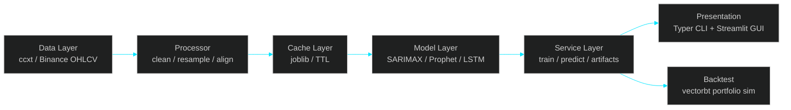
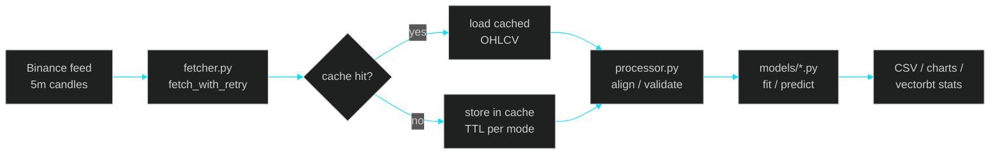
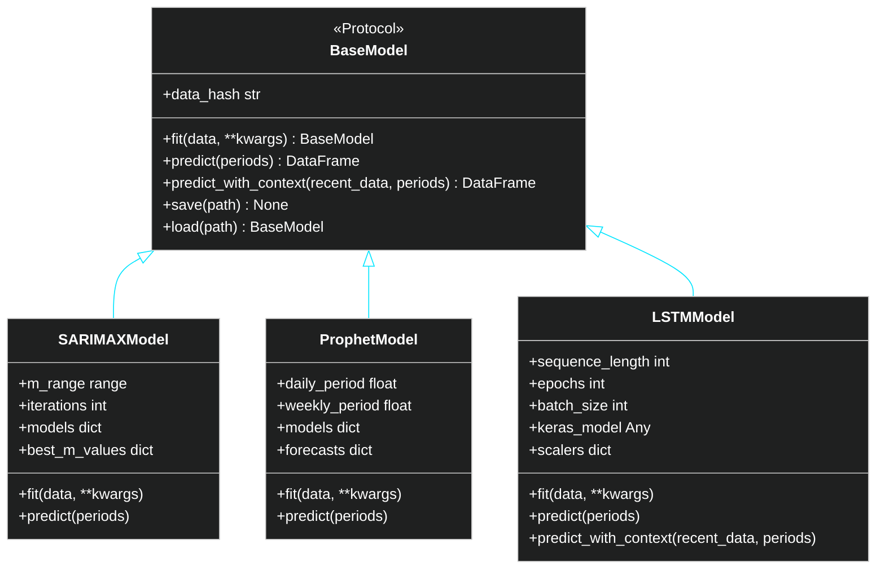
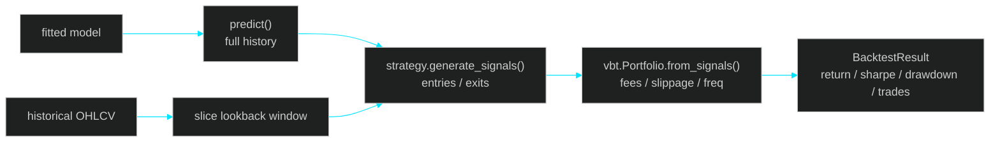

# SARIMAX OHLCV Prediction

<!-- TOC -->

## Table of Contents

- [SARIMAX OHLCV Prediction](#sarimax-ohlcv-prediction)
  - [Table of Contents](#table-of-contents)
  - [Table of Contents](#table-of-contents)
  - [Architecture](#architecture)
    - [Data flow](#data-flow)
    - [Model interface](#model-interface)
  - [Getting Started](#getting-started)
    - [Prerequisites](#prerequisites)
    - [Install](#install)
    - [Quick check](#quick-check)
  - [Usage](#usage)
    - [CLI](#cli)
    - [Streamlit GUI](#streamlit-gui)
  - [Project Structure](#project-structure)
  - [Configuration](#configuration)
  - [Caching](#caching)
  - [Backtesting](#backtesting)
  - [Model Comparison](#model-comparison)
  - [Development](#development)
    - [Toolchain](#toolchain)
    - [Pre-commit](#pre-commit)
    - [Adding a new model](#adding-a-new-model)
  - [Troubleshooting](#troubleshooting)
  - [Glossary](#glossary)
  - [License](#license)

<!-- /TOC -->


[](https://www.python.org/downloads/)
[](LICENSE)
[](https://docs.astral.sh/ruff/)

Bitcoin price prediction toolkit built on **SARIMAX**, **Prophet**, and **LSTM**. Fetches live and historical OHLCV data from Binance, trains forecasting models, runs vectorized backtests, and exposes both a **Typer CLI** and a **Streamlit GUI**.

---

## Table of Contents

- [Architecture](#architecture)
  - [Data flow](#data-flow)
  - [Model interface](#model-interface)
- [Getting Started](#getting-started)
  - [Prerequisites](#prerequisites)
  - [Install](#install)
  - [Quick check](#quick-check)
- [Usage](#usage)
  - [CLI](#cli)
  - [Streamlit GUI](#streamlit-gui)
- [Project Structure](#project-structure)
- [Configuration](#configuration)
- [Caching](#caching)
- [Backtesting](#backtesting)
- [Model Comparison](#model-comparison)
- [Development](#development)
  - [Toolchain](#toolchain)
  - [Pre-commit](#pre-commit)
  - [Adding a new model](#adding-a-new-model)
- [Troubleshooting](#troubleshooting)
- [Glossary](#glossary)
- [License](#license)

---

## Architecture

The package follows a layered architecture: data ingestion, model abstraction, training/prediction services, backtesting, and presentation.



### Data flow



### Model interface



---

## Getting Started

### Prerequisites

- Python 3.10 or newer
- [pdm](https://pdm.fming.dev/) for dependency management
- Git

### Install

```bash
git clone https://github.com/simwai/sarimax-ohlcv-prediction.git
cd sarimax-ohlcv-prediction
pdm install
```

### Quick check

```bash
pdm run lint
pdm run typecheck
pdm run test
```

---

## Usage

### CLI

The CLI is built with **Typer** and exposes subcommands for the full workflow.

```bash
# Fetch current 24h of 5m BTC/USDT candles
pdm run fetch --mode current

# Train SARIMAX on 100 days of historical data
pdm run train --model sarimax --lookback 100 --iterations 100

# Predict next 12 periods
pdm run predict --model sarimax --periods 12

# Backtest with default settings
pdm run backtest --model sarimax --lookback 500

# Compare SARIMAX vs Prophet vs LSTM
pdm run compare --models sarimax prophet lstm
```

### Streamlit GUI

```bash
pdm run streamlit
```

The GUI provides interactive controls for model selection, lookback window, iteration count, and prediction horizon, with live Plotly charts and CSV export.

---

## Project Structure

```text
sarimax-ohlcv-prediction/
├── src/sarimax_ohlcv_prediction/
│   ├── __init__.py
│   ├── config.py                 # Frozen dataclass settings
│   ├── streamlit_app.py          # Streamlit GUI
│   ├── models/
│   │   ├── base.py               # BaseModel protocol + ABC
│   │   ├── protocol.py           # Structural subtyping protocol
│   │   ├── sarimax.py            # SARIMAX via pmdarima
│   │   ├── prophet.py            # Prophet with custom seasonality
│   │   └── lstm.py               # Keras LSTM multi-output
│   ├── data/
│   │   ├── fetcher.py            # ccxt Binance fetch + retry
│   │   ├── processor.py          # timestamp / alignment helpers
│   │   └── schemas.py            # typed data contracts
│   ├── services/
│   │   ├── training.py           # fit orchestration
│   │   ├── prediction.py         # predict orchestration
│   │   └── artifacts.py          # save/load wrappers
│   ├── backtest/
│   │   ├── engine.py             # vectorbt portfolio sim
│   │   └── strategies/
│   │       ├── base.py
│   │       ├── exit_after_n.py
│   │       └── exit_on_signal.py
│   ├── cli/
│   │   ├── main.py               # Typer app
│   │   └── commands/
│   │       ├── fetch.py
│   │       ├── train.py
│   │       ├── predict.py
│   │       ├── backtest.py
│   │       ├── explore.py
│   │       └── compare.py
│   └── viz/
│       ├── plotly.py             # interactive charts
│       ├── theme.py              # Catppuccin / Dracula palettes
│       └── components.py         # shared plot helpers
├── tests/
├── pyproject.toml
├── .pre-commit-config.yaml
└── README.md
```

---

## Configuration

All tunables live in `Settings` (`src/sarimax_ohlcv_prediction/config.py`), a frozen dataclass:

```python
symbol = "BTC/USDT"
timeframe = "5m"
default_lookback_days = 100
default_prediction_periods = 12
lstm_sequence_length = 60
lstm_epochs = 50
backtest_init_cash = 10000.0
backtest_fees = 0.001
```

Override values by passing CLI flags or editing the dataclass defaults at the composition root.

---

## Caching

The package uses a file-based cache with TTL per artifact type:

| Artifact | TTL |
|---|---|
| Current OHLCV | 1 hour |
| Historical OHLCV | 24 hours |
| Predictions | 30 minutes |
| Trained models | 7 days |

Cache control commands:

```bash
pdm run cache status
pdm run cache clear --all
```

---

## Backtesting

The backtesting engine wraps **vectorbt** and supports pluggable exit strategies.



Key metrics returned by `run_backtest`:

- Total return
- Sharpe ratio
- Maximum drawdown
- Win rate
- Total trades
- Average trade return
- Profit factor
- Equity curve
- Trade log

---

## Model Comparison

`pdm run compare` runs a fast benchmark across models and reports timing and metric deltas. Use it to understand trade-offs between statistical rigor and latency.

| Model | Strengths | Considerations |
|---|---|---|
| SARIMAX | Strong on univariate seasonality; AIC-optimized | Auto-ARIMA search can be slow on large `m_range` |
| Prophet | Handles holidays and custom seasonality | Additive only; less robust to volatility clusters |
| LSTM | Learns multivariate interactions | Requires GPU for training speed; needs more data |

---

## Development

### Toolchain

| Tool | Role |
|---|---|
| ruff | Lint + format |
| pyrefly | Type check |
| pytest | Tests |
| pdm | Package management |

### Pre-commit

Pre-commit hooks enforce secret scanning, formatting, linting, type checking, fast unit tests, and file hygiene.

```bash
pdm run pre-commit install
pdm run pre-commit run --all-files
```

### Adding a new model

1. Implement the `BaseModel` protocol in `src/sarimax_ohlcv_prediction/models/`.
2. Register the model in `MODEL_REGISTRY` (`models/__init__.py`).
3. Wire CLI options in `cli/parsers.py`.
4. Add tests in `tests/`.

---

## Troubleshooting

| Symptom | Cause | Fix |
|---|---|---|
| `ModuleNotFoundError: tensorflow` | LSTM extras not installed | `pdm install` or install TensorFlow manually |
| Slow SARIMAX search | Large `m_range` + high `maxiter` | Reduce `--iterations` or narrow `--m-range` |
| Backtest returns NaN | Predictions contain missing values | Increase lookback or check data quality |
| Streamlit cache stuck | Resource cache not invalidated | Restart the Streamlit process |

---

## Glossary

- **ARIMA**: AutoRegressive Integrated Moving Average.
- **SARIMAX**: Seasonal ARIMA with eXogenous regressors. In this project, exogenous regressors are not used; the name reflects the `pmdarima` API.
- **OHLCV**: Open, High, Low, Close, Volume. Standard candlestick schema.
- **auto_arima**: `pmdarima` function that searches over `(p,d,q)(P,D,Q)m` to minimize AIC/BIC.
- **m**: Seasonal period. For 5-minute BTC data, `m=288` represents one day.
- **LSTM**: Long Short-Term Memory. Recurrent neural network architecture for sequential data.
- **vectorbt**: Vectorized backtesting library for position-level portfolio simulation.
- **TTL**: Time-to-live. Cache entries expire after this duration.
- **data_hash**: Hash of the training DataFrame used for cache invalidation.
- **REPL**: Read-Eval-Print Loop. Interactive command shell provided by the CLI.
- **Typer**: Python CLI framework built on type hints.
- **Streamlit**: Framework for interactive data apps.

---

## License

MIT
